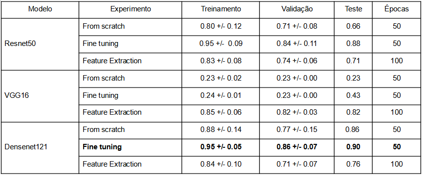
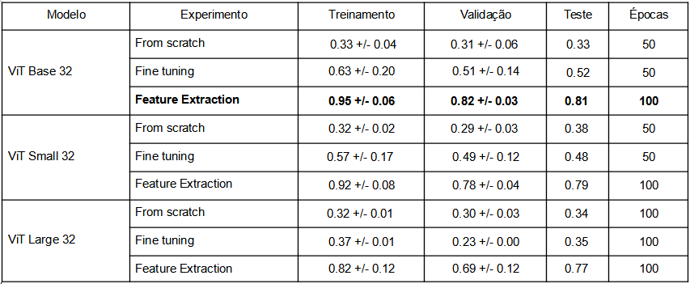
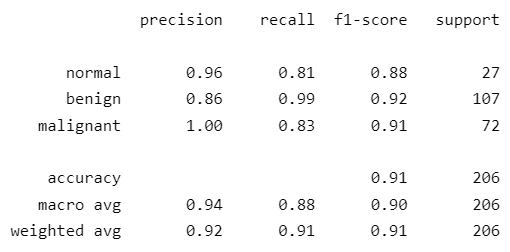
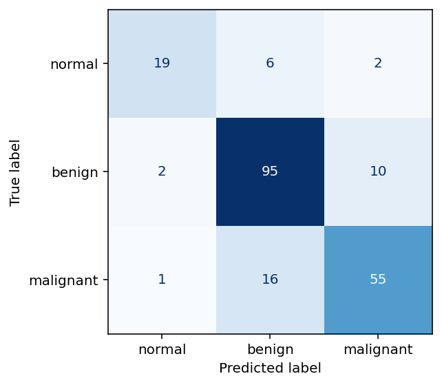
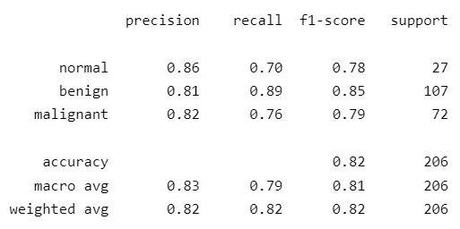

<!-- antes de enviar a versão final, solicitamos que todos os comentários, colocados para orientação ao aluno, sejam removidos do arquivo -->
# Classificação de Imagens de Ultrassonografia Mamária por meio de Aprendizagem Profunda

#### Aluno: [Geilson Gomes Araujo](https://github.com/Geilson-Araujo)
#### Orientadora: [Manoela Kohler](https://github.com/manoelakohler).

---

Trabalho apresentado ao curso [BI MASTER](https://ica.puc-rio.ai/bimaster/) como pré-requisito para conclusão de curso e obtenção de crédito na disciplina "Projetos de Sistemas Inteligentes de Apoio à Decisão".

<!-- para os links a seguir, caso os arquivos estejam no mesmo repositório que este README, não há necessidade de incluir o link completo: basta incluir o nome do arquivo, com extensão, que o GitHub completa o link corretamente -->
- [Link para o código](https://github.com/Geilson-Araujo/BI-Master_PUC-Rio). <!-- caso não aplicável, remover esta linha -->

---

### Resumo

<!-- trocar o texto abaixo pelo resumo do trabalho, em português -->

O presente trabalho objetiva classificar, por meio de aprendizagem profunda, imagens de ultrassonografia mamária, a fim de corroborar que tais modelos podem ser aliados à Saúde, especificamente com respeito ao diagnóstico eficaz do câncer de mama.

Para tal, utilizou-se 3 (três) modelos de redes neurais convolucionais (CNNs): Resnet50, VGG16, Densenet121 e outros 3 (três) de _vision transformers_ (ViTs): ViT-Base-Patch32, ViT-Small-Patch32, ViT-Large-Patch32.

Em consequência, o modelo CNN com melhor desempenho alcançou um F1-score (macro) de 0,90 sobre os dados de teste, enquanto o modelo ViT; 0,81 - resultados, portanto, satisfatórios  ao objetivo principal deste trabalho.

### 1. Introdução

O câncer de mama, segundo dados do Instituto Nacional de Câncer ([INCA](https://www.gov.br/inca/pt-br/assuntos/gestor-e-profissional-de-saude/controle-do-cancer-de-mama)), é o de maior incidência no Brasil - exceto pelos tumores de pele não melanoma - e a principal causa de morte por câncer na população feminina - com exceção da região Norte, onde o câncer de colo do útero é a causa principal.

Assim, desde meados nos anos 80, políticas públicas vêm sendo desenvolvidas pelo Estado a fim de estabelecer ações de controle da doença no país. Dentre essas ações há o __rastreamento__ por meio de exames de imagens.

Com efeito, quanto mais cedo o câncer de mama for detectado, maior a possibilidade de tratamentos menos agressivos, mais efetivos e com menor morbidade associada.

Predominantemente, utilizam-se redes neurais convolucionais (CNNs) para o processo de análise de imagens digitais. Contudo, outros modelos podem também ser promissores.

Portanto, esse trabalho procura também contrastar, em relação aos já estabelecidos modelos CNNs, o desempenho dos recentes modelos de visão computacional baseados em transformers ([ViT](https://arxiv.org/abs/2010.11929)).

### 2. Modelagem

Utilizou-se duas bases de dados públicas:

* Breast Ultrasound Images Dataset ([BUSI](https://www.kaggle.com/datasets/aryashah2k/breast-ultrasound-images-dataset)), que possui 780 imagens de ultrassonografias de mama, sendo  133 de casos normais, 437 de tumores benígnos e 210 malignos;
* E Breast Ultrasound Image ([BUI](https://data.mendeley.com/datasets/wmy84gzngw/1)), contendo 250 imagens de câncer de mama, sendo 100 imagens referentes a tumores benignos e 150 malignos.

O pré-processamento realizado consistiu em converter todas as imagens para 224x224 pixels, cada qual com três dimensões correspondentes ao RGB. Além disso, na etapa de normalização das imagens, foram utilizados os mesmo valores de média e desvio-padrão referentes ao modelo originalmente treinado.

Os dados foram separados em dois subconjuntos, sendo 80% para treino - e validação - e 20% para teste, de forma estratificada, ou seja, procurou-se manter as mesmas proporções das categorias das  imagens em ambos os grupos.

Para os experimentos foram utilizados os seguintes modelos - 3 (três) CNNs e 3 (três) ViTs -, respectivamente:

* Resnet50;
* VGG16;
* Densenet121;
* ViT-Base-Patch32;
* ViT-Small-Patch32;
* ViT-Large-Patch32.

Na etapa de treinamento do modelo foi realizada a validação-cruzada com 5 (cinco) folds. Utilizou-se também a cross entropy loss como função de custo, a F1-score (macro) como métrica principal, o Adam como otimizador e a taxa de aprendizagem do modelo era ajustada quando não havia melhoria da _validation loss_ por 10 épocas.

Foram conduzidos três tipos de experimentos por modelo. No primeiro caso não se utilizou _transfer learning_, somente a estrutura do modelo foi utilizada para o treinamento. Já no segundo, utilizou-se o método _fine tuning_ e por último, o _feature extraction_. 

Ademais, alterou-se a última camada de cada um dos modelos, a fim de a saída dos mesmos corresponder à quantidade de classes da variável alvo - 3 (três), neste caso.

### 3. Resultados

Abaixo, as tabelas dos resultados para os experimentos realizados com os modelos CNNs e ViTs.

Foram obtidos os seguintes resultados para os modelos CNNs:

Foram obtidos os seguintes resultados para os modelos ViTs:

Obs.: Para aqueles modelos que demonstraram potencial de melhoria próximo a 50 épocas, utilizou-se 100 épocas.

Conforme as tabelas acima, no caso das redes convolucionais, o modelo com melhor desempenho foi o _fine tuning_ do Densenet121, com F1-score (macro) de 0.90 sobre a base de teste. E no caso dos modelos _vision transformers_, o de melhor desempenho foi o _feature extraction_ do ViT-Base-32, por meio do qual se obteve um F1-score (macro) de 0.81.

Em complemento às informações acima, abaixo estão a matriz de confusão e o _classification report_ do melhor modelo CNN e ViT, respectivamente:

<table><tr>
<td>  </td>
<td>  </td>
</tr></table>

<table><tr>
<td>  </td>
<td>  </td>
</tr></table>

### 4. Conclusões

Para o conjunto de dados, modelos e parâmetros utilizados, todas as redes neurais convolucionais superaram o melhor resultado obtido pelo ViT em algum dos experimentos.

Contudo, há ainda outras técnicas que podem ser agregadas, tais como: data augmentation, balanceamento de classes, outras funções de custo, outras métricas, test-time augmentation, modelos híbridos.

Entretanto, o resultado mais relevante foi o modelo com melhor desempenho ter conseguido prever todos os casos de tumores malignos corretamente na base de testes, sem falsos negativos para esta classe.

Dessa forma, os resultados obtidos corroboram o pressuposto de os modelos de aprendizagem profunda serem potencialmente grandes aliados ao diagnóstico eficiente de câncer de mama. Ainda que, _a priori_, os dados tenham sido escassos, houve um desempenho satisfatório na classificação das imagens. Com efeito, quanto maiores os avanços nesse campo, mais e melhores modelos estarão disponíveis e, por consequência,  mais vidas poderão ser salvas.

---

Matrícula: 192.110.140

Pontifícia Universidade Católica do Rio de Janeiro

Curso de Pós Graduação *Business Intelligence Master*
